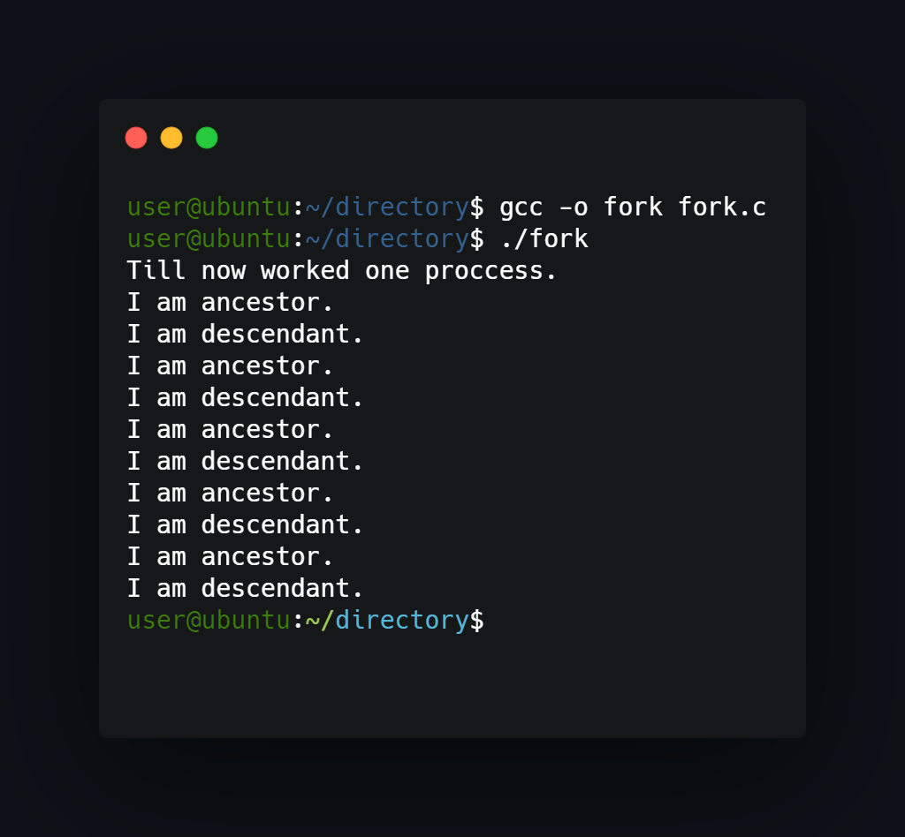

## What project do?
___
This project uses fork function to divide itself to parent-child mode and based on process identyficator writes message about it's function.



## How to install?
___
Program don't require installation, only compilation required.

## How to use?
___
To compile and run program use gcc compiler or any other:
```
gcc -o fork fork.c
./fork
```

<!--https://banner.godori.dev/ height:150-->
<!--https://shields.io/-->
<!--https://carbon.now.sh/-->